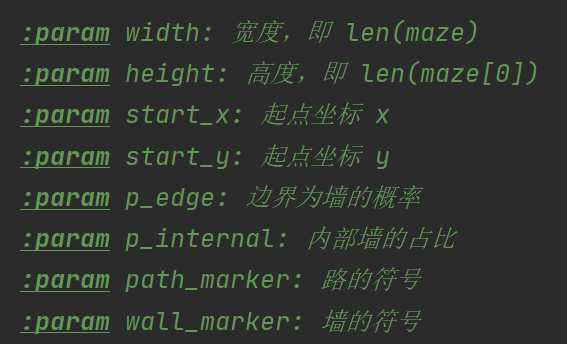

<header>

# 自动走迷宫的Python程序

_基于广度优先搜索（DFS）的迷宫自动求解，并将搜索过程可视化_

---
</header>

## 项目介绍

给定一个高为 *h* 、宽为 *w* 的迷宫，将一个小人放在其中的一个位置 ( *x , y* )，(0 ≤ x< h, 0 ≤ y < w)。
他一次只能往上、下、左、右四个方向走一格，那么这个小人该如何成功走到迷宫的边界？

迷宫包含**墙**（用@表示）和**路**（用空格表示）两个部分，在Python中用**列表套列表**的方式储存。
边界为墙的概率默认为 0.9，内部为墙的比例默认为 0.3。小人用大写字母 P 表示。
当 P 点走到迷宫边界时，游戏获得胜利；若无法走到迷宫边界，则游戏失败。

## 执行文件的运行

启动.exe文件，程序进入控制台，首先需要输入迷宫的宽高 (*h x w*) 和小人的位置坐标(*x,y*):

一次输入两个参数。由于内部有正则表达式支持，故格式可以任意（两个正整数前、中、后可以为任意非数字的字符）。然后程序会输出参数信息并停顿3秒，随后打印迷宫结构，小人自动在其中探索。

若小人成功走到边界，则控制台显示走过的路径，并输出`Success!`：

若小人无法走到边界，则回到初始点，输出`No solution found!`:

你可以尝试不同的迷宫参数和初始点，每次迷宫随机生成，祝玩的愉快！

> [!CAUTION]
> 迷宫的高度不能太大，若迷宫超过了控制台的当前页，则 P 点的位置打印会有偏差

## Python源码实现

面向对象的编程，定义迷宫类`Maze`和迷宫求解器`MazeSolver`。

在`Maze`中，参数如下：

在初始化迷宫时，使用 0 代表墙，1 代表路。在打印迷宫时，根据 *wall_marker* 和 *path_marker* 两参数对 0 和 1 进行替换。在控制台中，**迷宫的结构只打印一次**。

在`MazeSolver`中，使用迷宫对象`maze`和字符`person_marker`作为参数。另外还有：
1. `visited`大小和迷宫相同，每个元素初始化为`False`，用于标记某位置是否经过；
2. `last_x`和`last_y`用于标记小人上一步的位置，以便小人位置的更新；
3. `track`用于记录小人走过的路径，以便游戏胜利时打印结果。

使用**广度优先搜索(DFS)算法**寻找所有可能路径。每经过一个位置，更新`visited`、`last_x`、
`last_y`和`track`，并在控制台输出 P 点的位置，将搜索过程可视化，可下载[示例视频](assets\maze.mp4)。

在当前位置往 4 个方向搜索时，若其中一个方向遇到死路，则对`track`实行**出栈操作**，同步更新 P 点的位置，直到`track`中最后一个元素为原来的位置，从而实现 P 点的**逐步移动**。

<footer>

---
Email: xiaoxinxizhang@whu.edu.cn
</footer>